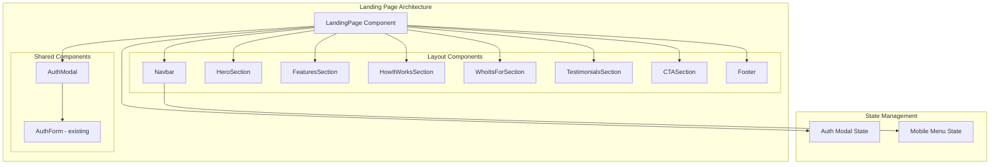

# Design Document: Landing Page

## Overview

This document outlines the technical design for the JobFinder SaaS landing page. The landing page will serve as the primary marketing entry point, showcasing the platform's AI-powered assessment capabilities while providing seamless integration with the existing authentication system. The design prioritizes a modern, professional aesthetic consistent with the existing application while ensuring optimal performance and accessibility.

## Architecture

The landing page follows a component-based architecture using React with TypeScript. It integrates with the existing application structure and reuses the AuthForm component within a modal dialog pattern.



## Components and Interfaces

### LandingPage Component
The main container component that orchestrates all landing page sections.

```typescript
interface LandingPageProps {}

interface LandingPageState {
  isAuthModalOpen: boolean;
  authMode: 'signin' | 'signup';
}
```

### Navbar Component
Fixed navigation bar with responsive behavior.

```typescript
interface NavbarProps {
  onSignIn: () => void;
  onSignUp: () => void;
}

interface NavLink {
  label: string;
  href: string;
}
```

### HeroSection Component
The prominent top section with headline and CTAs.

```typescript
interface HeroSectionProps {
  onGetStarted: () => void;
  onLearnMore: () => void;
}
```

### FeaturesSection Component
Grid of feature cards highlighting platform capabilities.

```typescript
interface Feature {
  icon: React.ReactNode;
  title: string;
  description: string;
}

interface FeaturesSectionProps {
  features: Feature[];
}
```

### HowItWorksSection Component
Step-by-step process visualization.

```typescript
interface Step {
  number: number;
  icon: React.ReactNode;
  title: string;
  description: string;
}

interface HowItWorksSectionProps {
  steps: Step[];
}
```

### WhoItsForSection Component
User type cards for TVET and ADOF audiences.

```typescript
interface UserType {
  title: string;
  description: string;
  benefits: string[];
  icon: React.ReactNode;
}

interface WhoItsForSectionProps {
  userTypes: UserType[];
  onGetStarted: () => void;
}
```

### TestimonialsSection Component
Social proof with testimonials and statistics.

```typescript
interface Testimonial {
  quote: string;
  name: string;
  role: string;
  avatar?: string;
}

interface Statistic {
  value: string;
  label: string;
}

interface TestimonialsSectionProps {
  testimonials: Testimonial[];
  statistics: Statistic[];
}
```

### CTASection Component
Final call-to-action section.

```typescript
interface CTASectionProps {
  onGetStarted: () => void;
}
```

### Footer Component
Site footer with links and copyright.

```typescript
interface FooterLink {
  label: string;
  href: string;
}

interface FooterLinkGroup {
  title: string;
  links: FooterLink[];
}

interface FooterProps {
  linkGroups: FooterLinkGroup[];
}
```

### AuthModal Component
Modal wrapper for the existing AuthForm.

```typescript
interface AuthModalProps {
  isOpen: boolean;
  mode: 'signin' | 'signup';
  onClose: () => void;
  onModeChange: (mode: 'signin' | 'signup') => void;
}
```

## Data Models

### Feature Data
```typescript
const FEATURES: Feature[] = [
  {
    icon: <Brain />,
    title: "AI-Powered Assessments",
    description: "Personalized tests generated by AI based on your role and interests"
  },
  {
    icon: <BookOpen />,
    title: "Course Recommendations",
    description: "Get tailored course suggestions based on your assessment results"
  },
  {
    icon: <TrendingUp />,
    title: "Progress Tracking",
    description: "Monitor your learning journey with detailed analytics and insights"
  },
  {
    icon: <Briefcase />,
    title: "Career Guidance",
    description: "Job-specific assessments and career path recommendations"
  }
];
```

### Steps Data
```typescript
const STEPS: Step[] = [
  { number: 1, title: "Register", description: "Create your account and select your role" },
  { number: 2, title: "Take Assessment", description: "Complete AI-generated personalized tests" },
  { number: 3, title: "Get Results", description: "Receive detailed analysis and scores" },
  { number: 4, title: "Recommendations", description: "Get personalized course and career guidance" }
];
```

### User Types Data
```typescript
const USER_TYPES: UserType[] = [
  {
    title: "TVET Students",
    description: "Technical and vocational education students",
    benefits: ["Skill assessments", "Course recommendations", "Progress tracking"]
  },
  {
    title: "ADOF Professionals",
    description: "Working professionals seeking career advancement",
    benefits: ["Job-specific tests", "Career guidance", "Competency analysis"]
  }
];
```

### Navigation Links
```typescript
const NAV_LINKS: NavLink[] = [
  { label: "Features", href: "#features" },
  { label: "How It Works", href: "#how-it-works" },
  { label: "Who It's For", href: "#who-its-for" },
  { label: "Testimonials", href: "#testimonials" }
];
```

### Role to Dashboard Mapping
```typescript
const ROLE_DASHBOARD_MAP: Record<string, string> = {
  'TVET': '/dashboard',
  'ADOF': '/adof',
  'ADMIN': '/admin/dashboard'
};
```

## Correctness Properties

*A property is a characteristic or behavior that should hold true across all valid executions of a system-essentially, a formal statement about what the system should do. Properties serve as the bridge between human-readable specifications and machine-verifiable correctness guarantees.*

Based on the prework analysis, the following properties have been identified:

### Property 1: Feature cards render with required elements
*For any* feature in the features array, the rendered feature card SHALL contain an icon, title, and description element.
**Validates: Requirements 3.1**

### Property 2: Steps render with required elements
*For any* step in the steps array, the rendered step SHALL display a number, icon, and description.
**Validates: Requirements 4.3**

### Property 3: User type cards contain required information
*For any* user type in the user types array, the rendered card SHALL display the target audience description and at least one benefit.
**Validates: Requirements 5.2**

### Property 4: Testimonials render with required fields
*For any* testimonial in the testimonials array, the rendered testimonial card SHALL display the quote, user name, and role.
**Validates: Requirements 6.2**

### Property 5: Footer links are grouped by category
*For any* footer link group, all links within that group SHALL be rendered under the correct category heading.
**Validates: Requirements 8.2**

### Property 6: Role-based redirect correctness
*For any* authenticated user with a valid role (TVET, ADOF, ADMIN), the redirect path SHALL match the expected dashboard path for that role.
**Validates: Requirements 9.2**

## Error Handling

### Modal State Errors
- If modal fails to open, log error and show toast notification
- Ensure modal can always be closed via escape key or clicking outside

### Navigation Errors
- If smooth scroll target doesn't exist, fail silently without breaking page
- Handle missing section IDs gracefully

### Authentication Errors
- Delegate to existing AuthForm error handling
- Display toast notifications for auth failures
- Maintain modal state on error to allow retry

### Responsive Breakpoint Handling
- Use Tailwind's responsive utilities consistently
- Ensure no layout breaks at intermediate viewport sizes

## Testing Strategy

### Dual Testing Approach
This feature will use both unit tests and property-based tests to ensure comprehensive coverage.

### Property-Based Testing
- **Library**: fast-check (JavaScript property-based testing library)
- **Minimum iterations**: 100 per property test
- **Tag format**: `**Feature: landing-page, Property {number}: {property_text}**`

Property tests will verify:
1. Feature card rendering invariants
2. Step rendering invariants
3. User type card content invariants
4. Testimonial card content invariants
5. Footer link grouping invariants
6. Role-based redirect mapping correctness

### Unit Tests
Unit tests will cover:
- Component rendering with various props
- Modal open/close behavior
- Navigation link click handlers
- CTA button click handlers
- Mobile menu toggle behavior

### Integration Tests
- Auth modal integration with existing AuthForm
- Successful sign-in redirects to correct dashboard
- Successful sign-up switches modal to sign-in mode

### Test File Structure
```
src/
├── components/
│   └── landing/
│       ├── __tests__/
│       │   ├── LandingPage.test.tsx
│       │   ├── LandingPage.property.test.tsx
│       │   ├── Navbar.test.tsx
│       │   └── AuthModal.test.tsx
```
